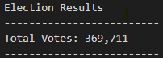
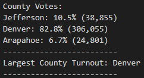
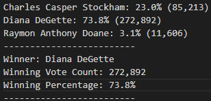

# Pypol with Python

## Overview of Election Audit
After submitting our original python script for the elecion results for the candidates, the election commission requested that we glean additional information from the raw data about the election looking more closely at county participation. Specifically, we were asked to find out the voter turnout for each county along with the percentage of votes cast from each county. Furthermore, the election commision asked us to determine the county with highest turnout. 

## Election Audit Results
We were able to alter the original script to gather specific analysis including the following:
  - There were a total of 369,711 votes cast in this Congressional Election
  
  

  - Calculated the total number of votes cast in each county as well as the percentage of the total votes for each county in the district
    - Arapahoe County: 24,801 (6.7%)
    - Denver County: 306,055 votes (82.8%)
    - Jefferson County: 38,885 votes (10.5%)
  - With over four-fifths of the votes casts, Denver County had the most votes in this election

  - Calculated the total number of votes cast for each candidate as well as each candidates percentage of the total votes in the district
    - Diana DeGette: 272,892 votes (73.8%)
    - Raymon Anthony Doane: 11,606 votes (3.1%)
    - Charles Casper Stockham: 85,213 votes (23.0%)
  - Diane Degette won the election with 272,892 votes cast for her, giving her a winning percentage of 73.8% of all votes cast for this election
  
  
  
## Election Audit Summary
We have demonstrated that this script is viable for this specific election, however, we are more than confident that this script holds a very well constructed skeleton that can be modified to suit any election. Using the existing script, it would be able to handle a statewide election and analyze county participation. It could even handle multiple .CSV files and handle muliple elections by simply repurposing existing code and integrating it into the script. Furthermore, if the election commission would like more analysis on voter turnout vs registered voters vs eligible voting population and could supply us with additional raw data, we could use additional loops and logic statements to provide this information. This script has a lot of potential and would be very benificial for the election commission if it is implemented for various tasks.
